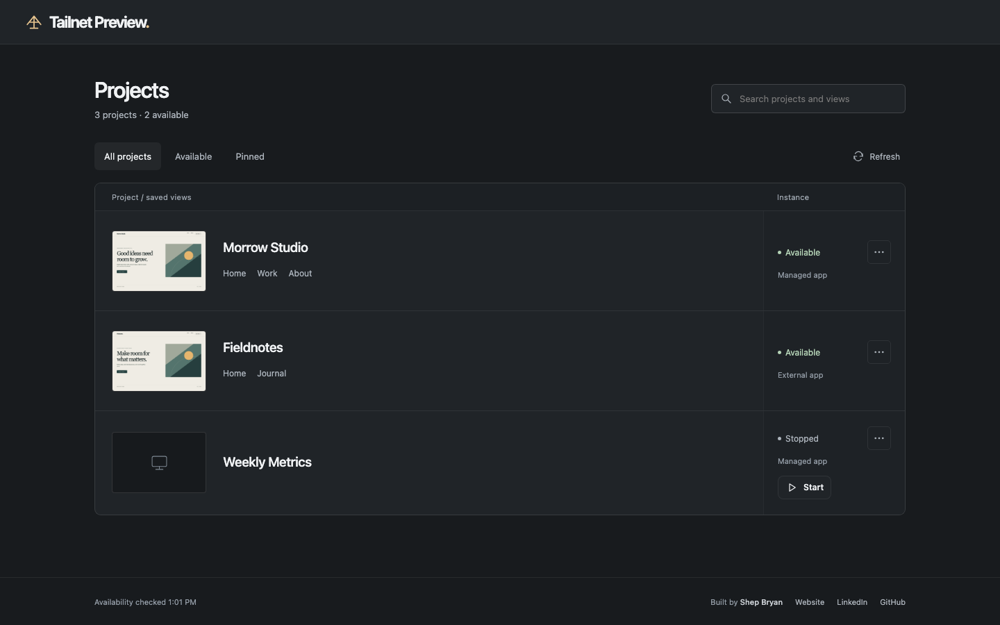
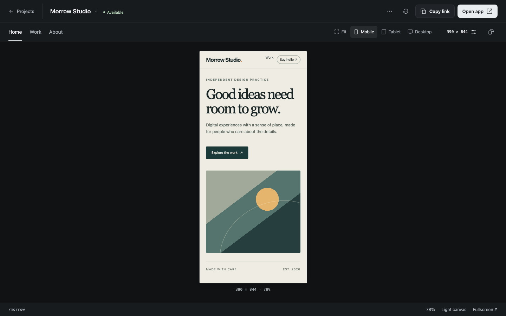

# Tailnet Preview

I made Tailnet Preview because I kept wanting to check a site on my phone while its dev server lived on my Mac. A screenshot wasn't the same as touching the page, and `localhost` stopped being useful as soon as I stepped away from the keyboard.

This gives each local web app a stable, private link on your Tailscale network. Open the real page on another device, try it at phone or desktop sizes, jump between saved routes, and manage the apps you've started—all from a small browser workspace. Your server stays on `127.0.0.1`; Tailscale Serve makes it reachable to devices your tailnet already trusts. It does not use Funnel.

## A look inside

These are real captures of the interface using fictional projects and a throwaway demo site. No personal projects or live tailnet data are shown.



*The library keeps each project's views, availability, and instance controls together.*



*The viewer lets you check a saved route at a specific size, then open or copy the direct app link.*

## Get a preview running

You'll need Node.js 20+, Tailscale connected on the host and viewing device, and macOS with launchd or Linux with a working user systemd instance. The app you're previewing needs to serve HTTP on loopback. Your phone can be on cellular; it only needs access to the host through your tailnet.

```bash
git clone https://github.com/elsheppo/tailnet-preview.git
cd tailnet-preview
node install.mjs
PREVIEW="${CODEX_HOME:-$HOME/.codex}/skills/tailnet-preview/scripts/preview"
"$PREVIEW" doctor
```

The default installer location makes the included [agent skill](SKILL.md) available to Codex. The CLI works without Codex too: install with `node install.mjs --dest /path/to/skills/tailnet-preview` and point `PREVIEW` at that directory's `scripts/preview`.

Then, from your app's directory:

```bash
"$PREVIEW" ensure --id=my-app --name='My App' -- npm run dev
```

The receipt includes a library URL, a viewer URL, and a direct app URL. Open the library on another trusted device and start exploring. Tailnet Preview discovers the host's tailnet name and free ports; you don't have to put machine-specific addresses in your project.

`ensure` supervises the app and keeps its identity and links across restarts. If another process already owns the server, use `"$PREVIEW" attach 3000 --id=my-app` instead. That preview stays available only while the external process is running. Named views use `--view=name=/route`; the full command reference is in [SKILL.md](SKILL.md).

## Built for a trusted tailnet

Tailnet Preview binds the gateway and app processes to loopback, uses Tailscale Serve rather than public Funnel, and leaves your existing Tailscale access policy alone. The library's browser controls can stop, restart, or remove supervised apps, with confirmation for disruptive actions. **Anyone your tailnet policy permits to reach the library can use those controls**; there is no separate admin login.

This release is for HTTP web previews. It doesn't deploy sites to the public internet or install iOS apps.

## Keep working on it

Run `node install.mjs` again after pulling an update, then `"$PREVIEW" reload-gateway` to load new browser assets. The gateway restarts briefly; registered projects, app processes, and direct links stay in the separate local state directory.

The UI source is in `source/`, generated pages are in `assets/`, and the CLI and gateway are in `scripts/`. Run `npm run check` to build and test locally. The tests use temporary loopback fixtures and don't require a live tailnet.

Released under the [MIT License](LICENSE). If you end up using it, [give me a shout](https://shepbryan.com)—I'd love to hear what you're building.
